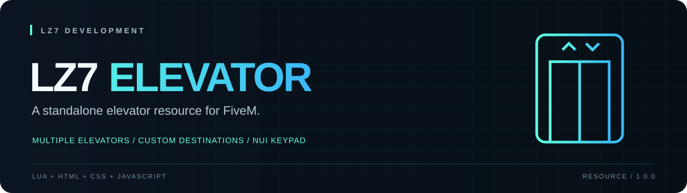

<p align="center">
  
</p>

<p align="center"><b>Configurable elevators for FiveM, with a compact NUI keypad.</b><br />Lua · HTML · CSS · JavaScript · No framework dependency</p>

<p align="center"><a href="#installation">Installation</a> · <a href="#configuration">Configuration</a> · <a href="#controls">Controls</a> · <a href="https://discord.gg/jVTRaGxu48">LZ7 Discord</a></p>

## Features

- Multiple independently configured elevators and destinations.
- Numeric floor selection using the on-screen keypad or keyboard.
- Current-floor display and invalid/current-floor feedback.
- Screen fade, destination heading and elevator audio.
- Configurable markers, interaction distance and notification text.
- Standalone client resource: no database, framework or package installation required.

## Requirements

- A FiveM server with support for the `cerulean` resource manifest and Lua 5.4.
- Accessible map interiors at the coordinates you configure. This resource does not include a map or MLO.

## Installation

1. Extract the resource into your server's resources directory.
2. Name the resource folder **`lz7-elevator`**. If downloading a GitHub source archive, remove the `-main` suffix.
3. Edit `config.lua` to match your map. The included police-elevator coordinates are examples, not universal locations.
4. Add the following to `server.cfg`, after any map resources that provide the interiors:

```cfg
ensure lz7-elevator
```

5. Start the server, or run `refresh` followed by `ensure lz7-elevator` in the server console.

Expected layout:

```text
lz7-elevator/
├── fxmanifest.lua
├── config.lua
├── client/main.lua
└── html/
    ├── index.html
    ├── style.css
    ├── app.js
    └── elevator.ogg
```

## Controls

| Action | Default control |
| --- | --- |
| Open near a configured floor | E |
| Enter a floor number | Keyboard digits or on-screen buttons |
| Confirm destination | Enter or ENT |
| Close panel | Escape or X |

The keypad accepts non-negative integer floor IDs **0–99**. The `10` button selects floor 10 directly. Reopen the panel to clear an unfinished selection. An invalid destination or the current floor displays feedback and clears the selection automatically.

## Configuration

| Setting | Default | Purpose |
| --- | --- | --- |
| `Config.OpenKey` | `38` | FiveM control ID for opening the panel (E) |
| `Config.DrawDistance` | `12.0` | Marker draw radius in game units |
| `Config.InteractDistance` | `1.8` | Radius for opening the panel |
| `Config.MarkerType` | `2` | Marker type |
| `Config.Text` | See file | Interaction prompt and notifications |
| `Config.Elevators` | Two examples | Elevator names, floor IDs and destinations |

Keep `InteractDistance` positive and no greater than `DrawDistance`. If you change `OpenKey`, update the key name in `Config.Text.open` too.

Each elevator needs a name and a `floors` table. Use numeric keys, not strings. Add at least two floors for useful travel; floor IDs may be non-consecutive.

```lua
Config.Elevators = {
    {
        name = 'Police Elevator',
        floors = {
            [0] = {
                label = 'Ground floor',
                coords = vector4(-406.97, -345.17, 38.43, 281.3)
            },
            [1] = {
                label = 'First floor',
                coords = vector4(-406.88, -345.49, 43.59, 254.19)
            }
        }
    }
}
```

`vector4(x, y, z, heading)` sets the destination and the player's facing direction. Place coordinates on safe, walkable surfaces. Floor labels are available in the configuration and NUI payload; the current keypad displays floor numbers rather than a label list.

UI wording and audio volume are in `html/app.js`; the hint and button layout are in `html/index.html`; appearance is in `html/style.css`. The travel sequence currently uses a 350 ms fade-out, a 4-second pause after teleporting, and a 350 ms fade-in in `client/main.lua`.

## Scope and limitations

- All travel logic runs on the client. There is no job restriction, permission check or server-side access control.
- This teleports the player ped; it does not animate an elevator cabin or provide a vehicle transport system.
- There is no shared cabin state or multiplayer elevator synchronization.
- Opening the HTML file in a normal browser does not reproduce FiveM interaction or teleportation.

## Troubleshooting

| Problem | Check |
| --- | --- |
| Resource does not start | Folder name, `server.cfg`, manifest and server-console errors |
| No marker or prompt | Coordinates, distances and whether the required interior/map is loaded |
| `NO FLOOR` | The entered number must exist as a numeric key in the current elevator |
| `CURRENT` | Select a different configured floor |
| Falling after travel | Destination height, collision and map resource availability |
| No audio or panel | Ensure all four files in `html/` are present; inspect the FiveM F8 console |

## Support

Contact [LZ7 Development on Discord](https://discord.gg/jVTRaGxu48). Include your resource version, steps to reproduce, relevant console errors and a redacted configuration excerpt.

## License

No license has been selected for this release preparation. This repository does not grant an additional permission to reuse or redistribute its contents. Contact LZ7 Development for usage terms.

---

<p align="center"><sub>LZ7 DEVELOPMENT · Scripts. Bots. Systems.</sub></p>
